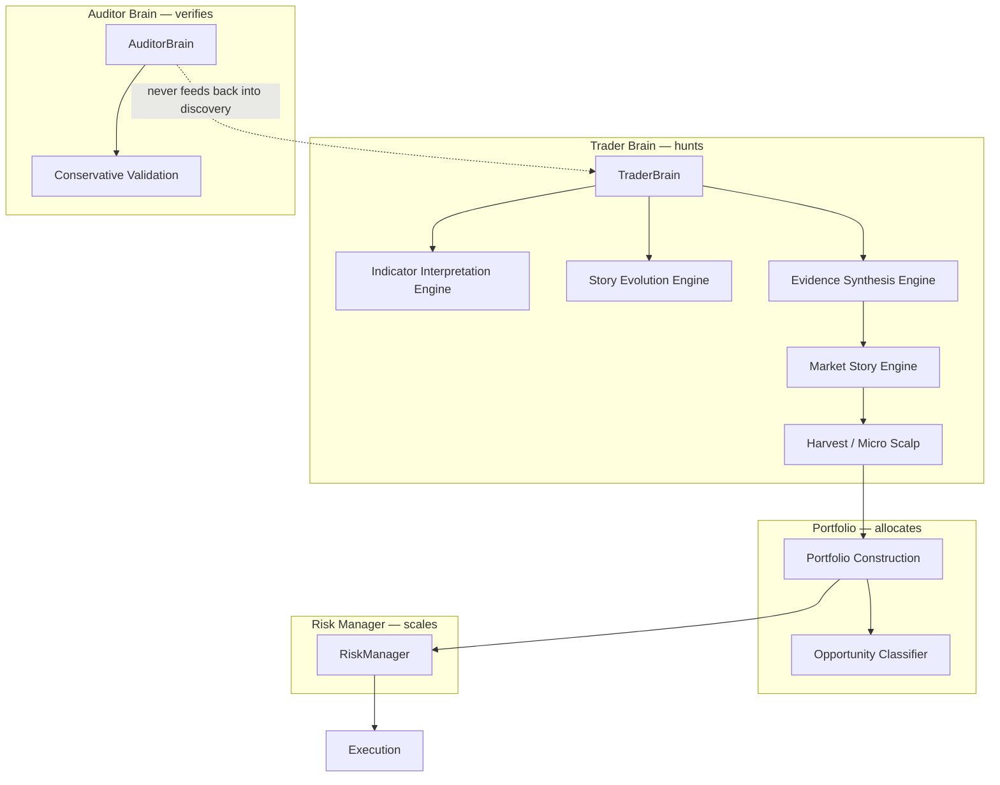

# Kraitos DNA — Evidence Synthesis Edition

**Checkpoint frozen:** 2026-06-11  
**Purpose:** Stable architectural checkpoint before further evolution.  
**Behaviour:** No runtime changes — documentation only.

---

## Edition identity

This checkpoint captures Kraitos after three converging doctrines:

1. **Unlimited simultaneous execution** — no hard cap on concurrent opportunities; slot crowding scales allocation.
2. **Allocation-only risk and portfolio** — valid stories receive sized capital; denial is the exception.
3. **Evidence synthesis market story** — all observations fuse into one coherent explanation; conflicts are interpreted, not rejected.

The edition name reflects the capstone intelligence layer: the **Evidence Synthesis Engine**, which replaces fragmented story rejection with unified narrative synthesis.

---

## Architectural separation



**Core law:** The Trader hunts. The Auditor verifies. The Auditor never dictates how opportunities are discovered.

---

## TraderBrain

**Module:** `brains/trader_brain.py`  
**Role:** Orchestrates all opportunity discovery and emits `TradeCandidate` objects.

The TraderBrain runs the full discovery pipeline per symbol:

| Stage | Component |
|-------|-----------|
| Context | Regime, multi-timeframe bias, market structure |
| Psychology | Indicator Interpretation Engine |
| Narrative | Story Evolution Engine → Evidence Synthesis → Market Story |
| Forecast | Story Forecast Engine, Opportunity Hunter Council |
| Allocation | Opportunity Allocator, Portfolio Construction |
| Setup | Harvest Engine, Micro Scalper, Entry Engine |

Key behaviours at this checkpoint:

- **`evaluate_all`** returns every valid path (harvest + scalp) — never rank-and-drop.
- **`_split_opportunity_candidates`** emits separate candidates per opportunity class when story is clear or harvest is allowed.
- Must **not** import conservative execution, validation gates, or auditor pessimism.
- Indicator interpretation enriches context; it never vetoes.

**DNA:**

> The Trader Brain understands markets, forecasts outcomes, discovers opportunities and executes decisively.  
> The Trader hunts.

---

## AuditorBrain

**Module:** `brains/auditor_brain.py`  
**Role:** Validates outcomes using conservative assumptions — never participates in story or scoring decisions.

Responsibilities:

- Conservative walk-forward validation (`verify_run`)
- Conservative fill simulation and trust verdicts
- Strategy quality gates (diagnostic only)
- Red-team bias audits

Hard separation enforced by tests: AuditorBrain must not import market story, harvest scoring, council, or forecast discovery modules.

**DNA:**

> The Auditor Brain validates outcomes using conservative assumptions to prevent bias and self-deception.  
> The Auditor never dictates how opportunities are discovered.  
> The Auditor verifies.

---

## Evidence Synthesis Engine

**Module:** `intelligence/evidence_synthesis_engine.py`  
**Role:** Collect evidence across categories and synthesise **one** coherent market story.

Evidence categories include: structure, bias, regime, sessions, volume, momentum, candlestick patterns, liquidity, and indicator psychology (`EvidencePiece`).

Output: `MarketStorySummary` with:

- `current_explanation` — unified narrative
- `supporting_evidence` / `contradicting_evidence`
- `confidence`, `probable_next_event`, `recommended_action`
- `allocation_bias` (harvest / proper / elite / scout / micro)
- `story_clear` and `unclear_reason` (insufficient / incoherent / random only)

**Doctrine:**

- Conflicting evidence is **interpreted**, not rejected.
- `story_unclear` only when insufficient, incoherent, or random noise dominates.
- The market story is not a label — it is the picture painted by all evidence combined.

The `MarketStoryEngine` delegates synthesis to this engine at this checkpoint.

---

## Story Evolution Engine

**Module:** `intelligence/story_evolution_engine.py`  
**Role:** Treats the market as a living narrative with nested timeframe propagation.

Layer model:

| Timeframe | Layer | Story type |
|-----------|-------|--------------|
| H8, H4 | Novel | Campaign, accumulation, distribution, exhaustion, compression, expansion |
| H1 | Chapter | Continuation, pullback, acceleration, weakening, reversal attempt |
| M15, M5 | Paragraph | Buyers/sellers defending, liquidity sweep, compression, breakout attempt |
| M1 | Sentence | Engulfing, rejection wick, momentum burst, inside/outside bar |

Each new candle contributes `CandleImpact` evidence. Impacts propagate up the chain (`M1 → M5 → M15 → H1 → H4`). Output: `NestedStoryState` with alignment, confidence trend, and probable evolution.

**DNA:**

> Every new candle contributes evidence to an evolving story.  
> Lower timeframes shape higher timeframes through accumulated information.  
> Kraitos reads the unfolding story of the market.

---

## Indicator Interpretation Engine

**Module:** `intelligence/indicator_interpretation_engine.py`  
**Role:** Interpret indicators as market psychology — evidence, never trade signals.

Indicators read: moving averages, ADX, RSI, MACD, Bollinger Bands, ATR, OBV, accumulation/distribution, volume, price action, candlesticks.

Each produces a `PsychologicalReading` covering:

- Who appears in control
- Conviction strengthening or weakening
- Momentum accelerating or fading
- Volatility expanding or compressing
- Participation support
- Psychological state (fear, greed, uncertainty, euphoria, panic, accumulation, distribution)

**Forbidden output:** `buy`, `sell`, `no_trade`, `veto`, `reject`, `block` (as standalone tokens).

Opportunity hints (`mean_reversion_snapback`, `compression_breakout`, etc.) expand recognition — they do not trigger or refuse trades.

Feeds `EvidenceSynthesisEngine` via `IndicatorInterpretation.to_evidence_pieces()` (`category: indicator_psychology`).

---

## Portfolio Allocation Doctrine

**Module:** `portfolio/portfolio_construction.py`, `portfolio/__init__.py`  
**Report:** `logs/portfolio_allocation_doctrine_report.md`

**DNA:**

> If Kraitos identifies a valid opportunity, Portfolio Management classifies and allocates rather than denies.  
> The default response is not 'No.' — the default response is: **'How much?'**

Principles:

- Classify into tiers: **HARVEST** (0.10–0.30%), **PROPER** (0.50–1.00%), **ELITE** (1.00–1.50%)
- Correlation, heat, daily loss, and open-position pressure **scale** sizing
- `NO_TRADE` only for catastrophic safety or absent valid TraderBrain story

---

## Risk Manager Allocation-Only Doctrine

**Module:** `risk/risk_manager.py`  
**Report:** `logs/risk_manager_allocation_only_report.md`

**Core law:** RiskManager scales size — **NEVER blocks** except catastrophic conditions.

### Block only if

1. Emergency stop active  
2. Live trading safety violation  
3. Broker/execution unavailable  
4. No valid TraderBrain story  
5. Drawdown ≥ 50% — stop new trades  
6. Drawdown ≥ 40% — extreme defensive micro-allocation (scale to floor)

### Scale (never reject)

| Factor | Scale bands |
|--------|-------------|
| Max open trades | 75% / 50% / 25% / 10% slot crowding |
| Daily loss budget | 100% / 75% / 50% / 25% |
| Correlation cluster | 100% / 80% / 60% / 40% / 20% |
| Portfolio heat | 100% / 75% / 50% / 25% / 10% |
| Symbol exposure | soft scale 75% / 50% / 25% |
| Loss streaks | 75% (3+) / 50% (5+) |
| Normal drawdown | 75% (15%+) / 50% (25%+) / 10% (40%+) |

**Floor:** Minimum allocated risk 0.01% or 0.01 lot — never zero unless catastrophic.

---

## Unlimited Simultaneous Execution

**Tracker:** `portfolio/unlimited_opportunity_tracker.py`  
**Reports:** `logs/unlimited_opportunity_execution_report.md`, `logs/simultaneous_trade_capacity_report.md`

Doctrine: **no max-open hard cap** — slot crowding scales allocation only.

Validation observations (2022–2023 walk-forward):

| Metric | Value |
|--------|-------|
| Opportunities seen | 5,808 |
| Trade intents taken | 4,290 |
| Max simultaneous open | 38 |
| Avg simultaneous open | 16.6 |

Remaining hard stops:

- VirtualAccount / RiskManager catastrophic gate (50% DD)
- Story unclear / no valid opportunity (TraderBrain)
- Emergency stop / live safety / broker unavailable

TraderBrain `_split_opportunity_candidates` emits all valid paths per symbol rather than selecting a single winner.

---

## Validation snapshots

Walk-forward scope: **2022–2023** (504 validation days).

### Snapshot L — Unlimited Opportunity

Baseline checkpoint after unlimited simultaneous execution and allocation-only doctrines.

| Metric | Value |
|--------|-------|
| Label | L (unlimited opportunity) |
| Trades | 709 |
| Win rate | 84.1% |
| Profit factor | 7.83 |
| Max drawdown | 1.31% |
| Average R | +0.94R |
| Trades/day | 1.41 |
| Story unclear (est.) | 42.0% |

### Snapshot M — Evidence Synthesis Edition (current)

Current checkpoint incorporating Evidence Synthesis Engine.

| Metric | Value |
|--------|-------|
| Label | M (evidence synthesis) |
| Trades | 1,035 |
| Win rate | 81.6% |
| Profit factor | 1.39 |
| Max drawdown | 1.95% |
| Average R | +0.17R |
| Trades/day | 2.05 |
| Synthesis unclear | 0.0% |
| Pipeline market_story rejects | 0.0% |

### Delta M vs L

| Metric | Delta |
|--------|-------|
| Trades | +326 |
| Win rate | −2.5pp |
| Profit factor | −6.44 |
| Max DD | +0.64pp |
| Average R | −0.77R |
| Trades/day | +0.65 |

**Interpretation:** Evidence synthesis recovered opportunity flow (story unclear dropped from ~42% to 0%) at the cost of lower per-trade edge metrics. More trades, lower average R — the system prioritises recognition and coherent narrative over selective rejection.

Source: `validation/conservative_validation.py` (`SNAPSHOT_L`, `SNAPSHOT_M`), `logs/evidence_synthesis_validation_report.md`.

---

## Test status at checkpoint

Verified **2026-06-11** with LibreOffice Python 3.12.12.

### DNA-critical suite (63 tests — all passed)

| Module | Tests |
|--------|-------|
| `test_indicator_interpretation_engine.py` | 7 |
| `test_evidence_synthesis_engine.py` | 8 |
| `test_trader_brain.py` | 6 |
| `test_story_evolution_engine.py` | 6 |
| `test_auditor_brain.py` | 5 |
| `test_risk_manager_allocation_only.py` | 14 |
| `test_unlimited_opportunity_execution.py` | 10 |
| `test_portfolio.py` | 3 |
| `test_market_story_engine.py` | 4 |

**Total DNA-critical:** 63 passed in 6.84s

### Core integration trilogy (21 tests — all passed)

```
tests/test_indicator_interpretation_engine.py   7 passed
tests/test_evidence_synthesis_engine.py       8 passed
tests/test_trader_brain.py                    6 passed
```

### Full repository

| Scope | Count |
|-------|-------|
| Total tests collected | 443 |
| Offline-marked tests | 365 |

---

## Key source files

| Component | Path |
|-----------|------|
| TraderBrain | `brains/trader_brain.py` |
| AuditorBrain | `brains/auditor_brain.py` |
| Evidence Synthesis | `intelligence/evidence_synthesis_engine.py` |
| Story Evolution | `intelligence/story_evolution_engine.py` |
| Indicator Interpretation | `intelligence/indicator_interpretation_engine.py` |
| Market Story (delegates to synthesis) | `intelligence/market_story_engine.py` |
| Portfolio Construction | `portfolio/portfolio_construction.py` |
| Risk Manager | `risk/risk_manager.py` |
| Unlimited Opportunity Tracker | `portfolio/unlimited_opportunity_tracker.py` |
| Validation snapshots | `validation/conservative_validation.py` |

---

## Doctrine hierarchy (precedence)

1. **TraderBrain** discovers — indicators and synthesis enrich, never veto.
2. **Evidence Synthesis** produces one story; unclear only for insufficient/incoherent/random.
3. **Portfolio** answers "how much?" for valid stories.
4. **RiskManager** scales; blocks only on catastrophic safety or invalid story.
5. **AuditorBrain** verifies conservatively — isolated from discovery.

---

*This document is the frozen DNA record for the Evidence Synthesis Edition. Further evolution should reference Snapshot M as the baseline.*
